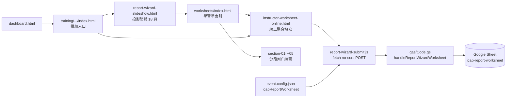

# icap-report-wizard-kit

**備援訓練模組**：協助撰寫「職能導向課程規劃與執行報告書」（勞動部 ODT 格式）。獨立於單一會議場次，可隨時開啟；與 iCAP 平台線上申請欄位應內容一致但介面不同。

**路徑英文、畫面中文**（必守）：詳見 `url-and-locale-standards` skill。

## 架構速覽



| 元件 | 路徑 | 用途 |
|------|------|------|
| 模組入口 | `training/icap-planning-report-wizard/index.html` | 索引、流程說明 |
| 投影簡報 | `.../report-wizard-slideshow.html` | meeting-display 18 頁 wizard |
| 學習單 hub | `.../worksheets/index.html` | 分段 + 整合入口 |
| 沉浸式走讀 | `.../worksheets/table1`～`table5-*-walkthrough.html` | 上課現場練習；不連 GAS；localStorage 僅當次 |
| 線上填寫 | `.../worksheets/instructor-worksheet-online.html` | 提交至試算表 |
| 提交 JS | `.../worksheets/report-wizard-submit.js` | 讀 config、組 payload |
| GAS handler | `gas/Code.gs` → `handleReportWizardWorksheet` | action `icap-report-worksheet` |
| 試算表分頁 | `icap-report-worksheet` | 講師學習單列 |
| Config | `event.config.json` → `icapReportWorksheet` | formType、sheetTab、GAS URL |
| 儀表板 | `dashboard.html` quick-links | 主辦一鍵開啟 |

**參考實作目錄：** `training/icap-planning-report-wizard/`  
**資產清單：** [ASSET-PACK.md](../../training/icap-planning-report-wizard/ASSET-PACK.md)  
**複製模板：** [templates/](../../training/icap-planning-report-wizard/templates/)

---

## 複製 SOP（10 步）

1. **複製模組資料夾** — 整包 `training/icap-planning-report-wizard/` 到新 repo 或同 repo 新子目錄（路徑保持英文 kebab-case）。
2. **替換單位／課程名稱** — 簡報封面、`index.html` 標題、線上學習單預設 `courseName`、各 section 頁 header（繁體中文 UI）。
3. **調整簡報內容** — 若報告格式或表1–12 說明不同，改 `report-wizard-slideshow.html` 各 `<section class="slide">`；同步更新 `MeetingDisplay.init({ labels: [...] })`（目前 18 頁）。
4. **對齊學習單欄位** — 線上版 `instructor-worksheet-online.html` 的 input id 須與 `report-wizard-submit.js` 的 `collectFlatFields()` 一致；改欄位時同步改 GAS `REPORT_WIZARD_FIELD_KEYS`。
5. **複製 GAS handler** — 確認 `gas/Code.gs` 含 `handleReportWizardWorksheet`、`REPORT_WIZARD_FIELD_KEYS`、`doPost` 路由 `icap-report-worksheet`（見 [templates/gas-handler-snippet.gs](../../training/icap-planning-report-wizard/templates/gas-handler-snippet.gs) 行號指標）。
6. **部署 GAS** — 試算表 → Apps Script → 貼 Code.gs → 執行 `testReportWizardWorksheet` → Web App 部署（任何人）。詳見 `meet-checkin-kit`。
7. **更新 config** — 在 `config/event.config.json`（或 preset）加入 `icapReportWorksheet` 區塊 + `backend.gasWebAppUrl`；執行 `node scripts/sync-config.js`。
8. **儀表板連結** — `dashboard.html` quick-links 指向新模組 `index.html` 與 `instructor-worksheet-online.html`；可選在 `events-registry.json` 加 `links.trainingReportWizard`。
9. **GitHub Pages** — repo 根目錄加 `.nojekyll`（若尚無）；push main → 硬刷新驗收 URL。
10. **端對端測試** — 線上學習單填一筆 → 提交 → 試算表 `icap-report-worksheet` 新列；GAS 異常時再跑 `testReportWizardWorksheet`。

主辦逐步操作（繁中）：[playbook.md](playbook.md)  
欄位 schema、檔案樹、檢查清單：[reference.md](reference.md)

---

## 自訂變數對照

| 變數 | 修改位置 | 範例 |
|------|----------|------|
| 主辦單位名稱 | 簡報封面、`index.html`、`org.name` in config | 臺灣道法總會 |
| 課程名稱 | 線上學習單 `#courseName`、payload `courseName` | 宮廟管理師職能導向課程 |
| GAS Web App URL | `event.config.json` → `backend.gasWebAppUrl` | `https://script.google.com/.../exec` |
| 試算表分頁 | `icapReportWorksheet.sheetTab` + GAS `REPORT_WIZARD_SHEET_NAME` | `icap-report-worksheet` |
| form action | `icapReportWorksheet.formType` + JS `formType()` | `icap-report-worksheet` |
| 簡報頁數／標籤 | `MeetingDisplay.init({ labels })` | 18 頁 ADDIE 導覽 |
| PDF 檔名前綴 | `icapReportWorksheet.dateFilePrefix` | `icap-report` |
| 線上表單路徑 | `icapReportWorksheet.onlineFormPath` | `training/.../instructor-worksheet-online.html` |

Config 模板：[templates/config-snippet.json](../../training/icap-planning-report-wizard/templates/config-snippet.json)

---

## 前端提交契約

```javascript
// report-wizard-submit.js → GAS
{
  action: 'icap-report-worksheet',
  formType: 'icap-report-worksheet',
  name, role, timestamp,
  courseName,
  fields: { /* REPORT_WIZARD_FIELD_KEYS 鍵名 */ },
  answers: [{ title, fields: [{ label, value }] }],
  pageUrl
}
```

- 送出：`fetch` + `mode: 'no-cors'` + `Content-Type: text/plain`
- GAS URL 來源：`window.EVENT_CONFIG.backend.gasWebAppUrl`（需載入 `event.config.js`）
- 成功 UI 代表「請求已發出」；以試算表列為準

**沉浸式走讀頁（table1–5 `*-walkthrough.html`）：** 僅上課逐段講解與現場練習；**不連 GAS**、不寫試算表。localStorage 暫存僅供當次練習；頁頂 `.practice-notice` 橫幅須保留。正式存檔請引導至 `instructor-worksheet-online.html`。

---

## 與其他 skill 的關係

| Skill | 角色 |
|-------|------|
| [meet-checkin-kit](../meet-checkin-kit/SKILL.md) | GAS 部署、no-cors POST、試算表綁定 |
| [meeting-display-deck](~/.cursor/skills/meeting-display-deck/SKILL.md) | 投影簡報 DOM/CSS/JS 模板 |
| [meeting-event-lifecycle](../meeting-event-lifecycle/SKILL.md) | 儀表板、registry；訓練模組非 active 活動綁定 |
| `url-and-locale-standards` | 路徑英文、UI 繁中 |

本模組**不綁**單一 `switch-event.js` preset；`icapReportWorksheet` 可在任一 active config 中共用同一 GAS 試算表。

---

## 故障排除

| 症狀 | 可能原因 | 處理 |
|------|----------|------|
| GitHub Pages 404 | Jekyll 忽略 `_` 開頭路徑或未部署 | 根目錄加 `.nojekyll`；確認 push main |
| 試算表無新列 | GAS URL 錯／未重新部署 | 對照 `gasWebAppUrl`；管理部署 → 新版本 |
| Console CORS 紅字 | 誤用 cors fetch | 維持 `no-cors`；403 可忽略若試算表有列 |
| action 未知 | 前後端字串不一致 | 必須完全 `icap-report-worksheet` |
| 欄位空白 | JS id 與 `collectFlatFields` 鍵名脫鉤 | 對照 `REPORT_WIZARD_FIELD_KEYS` |
| 簡報堆疊成捲動頁 | CSS 404 | 查 `../../assets/meeting-display.css` 層級 |

GAS 後端自測：Apps Script 執行 `testReportWizardWorksheet` → 執行紀錄 `{"ok":true}`。

---

## 商業複製／套版說明

**可原樣複製（generic）：**

- 目錄結構、`report-wizard-submit.js` 流程
- GAS handler 模式、`REPORT_WIZARD_FIELD_KEYS` schema（勞動部 ODT 表1–12）
- meeting-display 簡報骨架、worksheets hub 模式
- Config 區塊 `icapReportWorksheet`

**必須在地化（per 職能導向計畫）：**

- 主辦單位、計畫名稱、預設課程名稱
- 簡報案例文案、職能依據引用
- 獨立 Google 試算表 + GAS 部署 URL
- `dashboard.html` / 對外推廣連結
- 若欄位與 ODT 不同 → 同步改 HTML、JS、GAS 三處

**對外販售／推廣資產包時**，交付物建議包含：投影簡報 URL、學習單 URL、主辦 playbook、空白試算表副本、`ASSET-PACK.md`、本 skill 目錄。

---

## 修改檢查清單

| 改動 | 必做 |
|------|------|
| 改 `report-wizard-submit.js` | bump `?v=` in HTML |
| 改 `gas/Code.gs` | `testReportWizardWorksheet` + GAS 新版本部署 |
| 改 GAS URL | `event.config.json` → `sync-config.js` → push |
| 改簡報 | 確認 labels 數量 = slide 數；CSS 路徑實測 |
| 新增欄位 | HTML + JS + GAS `REPORT_WIZARD_FIELD_KEYS` 三處同步 |
| 新 repo Pages | 加 `.nojekyll` |

---

## Agent 守則

1. 投影簡報必用 **meeting-display** 模板，勿改成全頁捲動。
2. 勿改 `meet-checkin-kit` 已驗證的簽到 hidden form 邏輯來「修」本模組。
3. 改 GAS 後提醒使用者 **新版本部署**（非只儲存）。
4. 路徑英文 kebab-case；使用者可見文案繁體中文。
5. 使用者未要求時不要 `git commit` / `push`。

---

## 延伸閱讀

- [reference.md](reference.md) — 完整檔案樹、試算表欄位、複製檢查表
- [playbook.md](playbook.md) — 主辦／講師現場 SOP（繁中）
- [ASSET-PACK.md](../../training/icap-planning-report-wizard/ASSET-PACK.md) — 資產包清單與 URL
